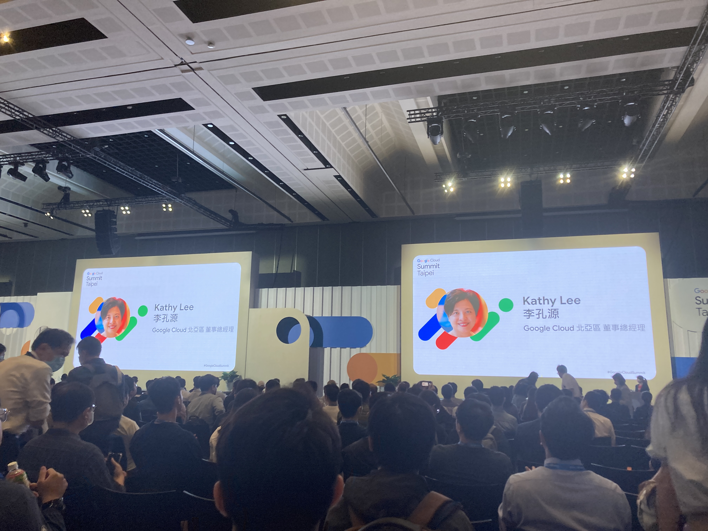
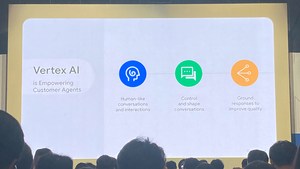
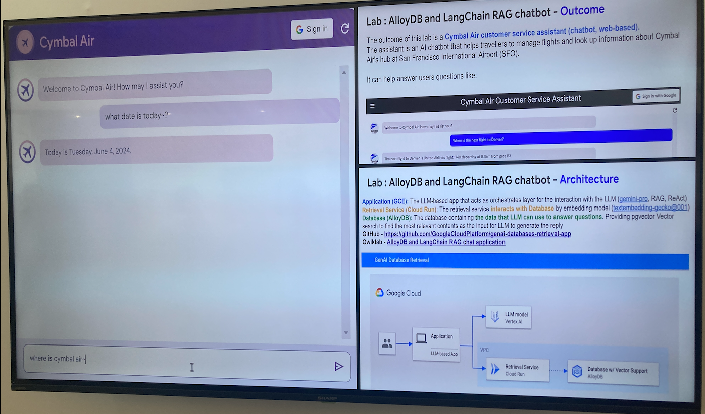
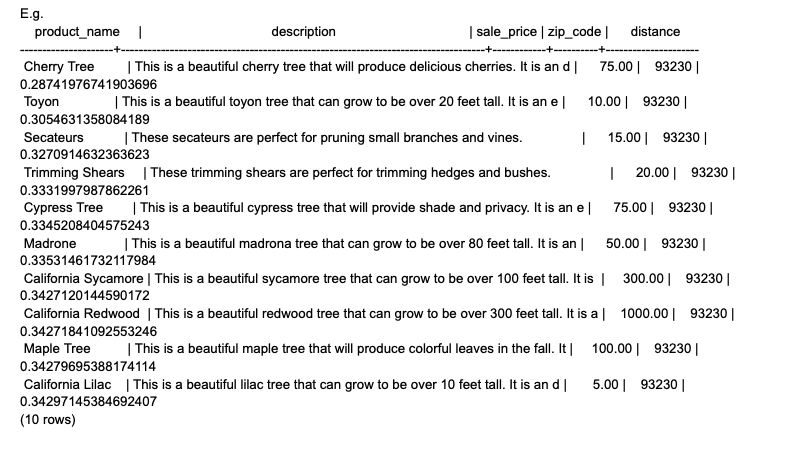

# 這次的 Google Cloud Submit 可以用 AI 來總結

## 副標題可以叫做 RAG(Retrieval-Augmented Generation)

這次的議程我參加了兩個 Workshop
- Migration from PostgreSQL to Alloy DB for accelerating
GenAl Vector Search & Embedding
- Multimodality with Gemini
  
## 有趣的案例
語音客製化
- Vertex AI 能夠進行類似人類的對話和互動，使得與客戶的交流更加自然，根據不同的語調性別年齡產生不同的語音還回應。


輿情分析 Tag 系統
- 輿情分析的時候需要大量的人原來對留言進行標注，這時候LLM 就很適合代替標注的人員

## LLM 的誤解
大多數人已經對 LLM 有所涉獵，但對其局限性認識不足。LLM 雖然功能強大，但在相似度搜索方面還不夠精確，而且有時候會唬爛。因此，需要使用 RAG 來提高搜索的精確性， 通常來講你必須給他一個比較既定事實陳述

## Embedding 的基本概念
簡單來說，Embedding 就是將一個對象轉換成向量，對象可以是任何數據（如語音、影片、文字）。然後透過向量搜索引擎找到與之最近的對象（即相似度最高的對象）。距離的算法有很多種，適用的場景也各不相同，有些適合全文搜索，有些則適合其他用途。

在 Embedding 領域，各家技術都有其優勢。
- OpenAI 提供的嵌入向量有 3,072 維，而
- Google 提供的嵌入向量則有 1,000 多維。Google 利用了其搜尋引擎的算法來生成這些嵌入向量。
  
不過市面上有很多開源的 embedding model ，距離的算法也很多，用的場景也不一樣
### 即時更新最新的資料
- 假設你是一個電商 你就可以透過 Embedding 在不把資料庫暴露的情況 update 最新資料, 你這時候就會有疑問 fine-tune 呢？？ 主要是貴 fine-tune 適用在模型更新不頻繁的時候
## Fine-tune
Fine-tune 是在模型更新不頻繁時的最佳選擇，雖然成本較高，但能針對特定需求進行調整。Fine-tune 可以看作是對 LLM 的進一步教育，讓它在既有的基礎上更好地適應特定任務。

## 比喻
LLM 就像是一個五歲的小孩，有了基本的邏輯和知識，
透過 Fine-tune 看你教育他強化他什麼，可以讓它在特定領域表現得更好。
但我們總不能沒事就重新生小孩
Embedding 就像是一本參考書或字典，給與小孩與現實資料接觸(grounding)


## Example

- 舉一個例子：如果你的使用者很智障 不知道要怎麼搜尋東西可以請LLM幫他。
請問有什麼好吃的 -> LLM (餐廳, 美食, 中餐) -> embedding 轉換 -> vector engine -> 無老鍋 -> LLM (我建議你吃無老鍋....)


## 這次 Google 強推的 Aolly Database

### Aolly Database
- 高效的向量搜索：Alloy Database 支持高效的向量搜索，這對於需要進行大量相似性計算的應用（如推薦系統和自然語言處理）非常有用。  
- 內建的向量操作支持：使用 pgvector，可以在 Alloy Database 中直接執行向量操作，無需額外的數據處理步驟。    
- 兼容 PostgreSQL：Alloy Database 兼容 PostgreSQL，這使得從 PostgreSQL 遷移過程變得相對簡單，並且能夠繼續使用熟悉的工具和生態系統。

Aolly Database 計算 vector distance
```shell
quickstart_db=> 
SELECT
        cp.product_name,
        left(cp.product_description,80) as description,
        cp.sale_price,
        cs.zip_code,
        (cp.embedding <=> embedding('textembedding-gecko','What kind of fruit trees grow well here?')::vector) as distance
FROM
        cymbal_products cp
JOIN cymbal_inventory ci on
        ci.uniq_id=cp.uniq_id
JOIN cymbal_stores cs on
        cs.store_id=ci.store_id
        AND ci.inventory>0
        AND cs.store_id = 1583
ORDER BY
        distance ASC
LIMIT 10;

```


搭配 LLM 一起用
```shell
WITH trees as (
SELECT
    cp.product_name,
    cp.product_description as description,
    cp.sale_price,
    cs.zip_code,
    cp.uniq_id as product_id
FROM
    cymbal_products cp
JOIN cymbal_inventory ci on
    ci.uniq_id=cp.uniq_id
JOIN cymbal_stores cs on
    cs.store_id=ci.store_id
    AND ci.inventory>0
    AND cs.store_id = 1583
ORDER BY
    (cp.embedding <=> embedding('textembedding-gecko','What kind of fruit trees grow well here?')::vector) ASC
LIMIT 1),
prompt as (
select
    'You are a friendly advisor helping to find a product based on the customer''s needs.
Based on the client request we have loaded a list of products closely related to search.
The list in JSON format with list of values like {"product_name":"name","product_description":"some description","sale_price":10}
Here is the list of products:' || json_agg(trees) || 'The customer asked "What kind of fruit trees grow well here?"
You should give information about the product, price and some supplemental information' as prompt
from
    trees)
select
    ml_predict_row(
 FORMAT('publishers/google/models/%s',
    'text-bison'),
    json_build_object('instances',
    json_build_object('prompt',
    prompt),
    'parameters',
    json_build_object('maxOutputTokens',
    2048))
    )->'predictions'->0->'content'
from
    prompt;

```

REF: [Migration from PostgreSQL to Alloy DB for accelerating
GenAl Vector Search & Embedding 參考資料]('https://docs.google.com/document/d/1mvST8zbHH7cOvEL0VQUARzyIiqdNyX_gPjfOU-8NIRs/edit')