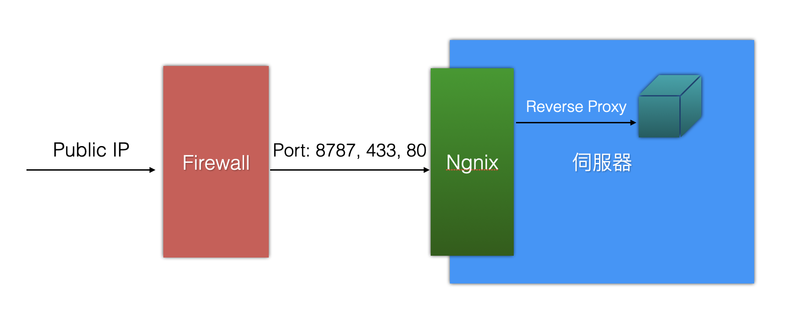

## 環境準備

- Public IP
- Domain Name
- 一台主機
    - 灌好 Nginx 作為這台主機的入口
    - 申請好 TLS 所需的憑證
- 一台 LoadBalancer 兼防火牆
- Gitlab 帳號


## Bootstrapping clusters with kubeadm

官方安裝教學：https://kubernetes.io/docs/setup/production-environment/tools/kubeadm/install-kubeadm/


- A compatible Linux host. The Kubernetes project provides generic instructions for Linux distributions based on Debian and Red Hat, and those distributions without a package manager.
- 2 GB or more of RAM per machine (any less will leave little room for your apps).
- 2 CPUs or more.
- Full network connectivity between all machines in the cluster (public or private network is fine).
- Unique hostname, MAC address, and product_uuid for every node. See here for more details.
- Certain ports are open on your machines. See here for more details.
- Swap disabled. You MUST disable swap in order for the kubelet to work properly.

## Installing a container runtime 
這裡可以選用你喜歡的，我選用 docker
## Installing kubeadm, kubelet and kubectl
- kubeadm: the command to bootstrap the cluster.
- kubelet: the component that runs on all of the machines in your cluster and does things like starting pods and containers.
- kubectl: the command line util to talk to your cluster.

Update the apt package index and install packages needed to use the Kubernetes apt repository:
```
sudo apt-get update
sudo apt-get install -y apt-transport-https ca-certificates curl
```
Download the Google Cloud public signing key:

```
sudo curl -fsSLo /usr/share/keyrings/kubernetes-archive-keyring.gpg https://packages.cloud.google.com/apt/doc/apt-key.gpg
```
Add the Kubernetes apt repository:

```
echo "deb [signed-by=/usr/share/keyrings/kubernetes-archive-keyring.gpg] https://apt.kubernetes.io/ kubernetes-xenial main" | sudo tee /etc/apt/sources.list.d/kubernetes.list
```

Update apt package index, install kubelet, kubeadm and kubectl, and 
pin their version:

```
sudo apt-get update
sudo apt-get install -y kubelet kubeadm kubectl
sudo apt-mark hold kubelet kubeadm kubectl
```

## kubeadm init

```
kubeadm init
```
Get admin kubeconfig
To start using your cluster, you need to run the following as a regular user:
```
  mkdir -p $HOME/.kube
  sudo cp -i /etc/kubernetes/admin.conf $HOME/.kube/config
  sudo chown $(id -u):$(id -g) $HOME/.kube/config
```


當你去查看所以有的服務會發現，CoreDNS 一直是處在 pending
以下是官翻的 trouble shooting
## CoreDNS is stuck in the Pending state
This is expected and part of the design. kubeadm is network provider-agnostic, so the admin should install the pod network add-on of choice. You have to install a Pod Network before CoreDNS may be deployed fully. Hence the Pending state before the network is set up.

解決辦法：安裝網路套件
CoreDNS
- https://cloud.tencent.com/developer/article/1820462
- https://kubernetes.io/docs/setup/production-environment/tools/kubeadm/troubleshooting-kubeadm/
- 我選用 Weave  
```
kubectl apply -f "https://cloud.weave.works/k8s/net?k8s-version=$(kubectl version | base64 | tr -d '\n')"
```

如果你只有一台伺服器要下下面這個指令才可以，讓 pod 部署在control-panel 同一台
```
kubectl taint nodes --all node-role.kubernetes.io/control-plane- node-role.kubernetes.io/master-
```
## 新增 User & Role & RoleBinding
- 簡單選用 RBAC 的策略
- 選擇User 認證方式，這邊選擇CA
- Create Role
- Create RoleBinding

認證的三種方法: https://kubernetes.io/docs/reference/access-authn-authz/bootstrap-tokens/  
CA Ref: https://www.adaltas.com/en/2019/08/07/users-rbac-kubernetes/  
自製CA 產生Tool: https://gitlab.com/k8s71/k8s_config_gen  
mTLS Ref: https://www.cloudflare.com/zh-tw/learning/access-management/what-is-mutual-tls/

接下來就是部署服務
```=yaml
apiVersion: apps/v1
kind: Deployment
metadata:
  name: ee-api
  namespace: ee-dev
spec:
  selector:
    matchLabels:
      app: ee-api
  template:
    metadata:
      labels:
        app: ee-api
    spec:
      containers:
      - name: ee-api
        image: registry.gitlab.com/fcuee/ee-api:v0.0.15-release
        resources:
          limits:
            memory: "300Mi"
            cpu: "500m"   
        ports:
        - containerPort: 4000
        env:
        - name: FIREBASE_CRED
          valueFrom:
            secretKeyRef:
              name: ee-api-secret
              key: FIREBASE_CRED
              optional: false
...............省略.........
      imagePullSecrets:
      - name: docker-rg-key

```


記得給k8s docker registry 的權限
```
kubectl create secret docker-registry regcred -n=ee-dev --docker-server=registry.gitlab.com --docker-username=<username> --docker-password=<token> --docker-email=<email> -n=ee-dev
```
Config: https://gitlab.com/k8s71/config_env

Apply deployment yaml， pod 啟動了，透過port forword 看到服務的內容
接下來就是要把服務開到 public

## Ingress
官網介紹 Ingress 的用途：https://kubernetes.io/docs/concepts/services-networking/ingress/

Ingress 有很多種，這裡選用nginx ingress(魔改過的ngnix)

- Nginx ingress yaml
https://raw.githubusercontent.com/kubernetes/ingress-nginx/controller-v1.3.0/deploy/static/provider/cloud/deploy.yaml
官方Nginx Ingress Doc：https://docs.nginx.com/nginx-ingress-controller/

接下來去查看Service
```
kubectl get service -A
```
你會發現 ngnix controller externel IP 是 pending 
然後開始等待...等待...等待良人回來那裡啊！！！ 回憶....
ＱＱ 自己架設的 k8s 不像 GKE 一樣有 LoadBalancer 幫你分配 IP

那有沒有比較簡單的做法，有的 NodePort 直接把 Port 對外
於是我就可以在這台電腦上 
```
curl localhost:30088
```
然後你會拿到 404 page not found
就算是成功了

接下來我們就要把服務與Ingress 串起來，以下設定
- 給開service 一個 ExternalName，並與 nginx-ingress 同 namespace
```=yaml
  apiVersion: v1
  kind: Service
  metadata:
    name: ee-api-service
    namespace: ingress-nginx
  spec:
    type: ExternalName
    externalName: ee-api-service.ee-dev.svc.cluster.local
    selector:
      app: ee-api
    ports:
    - port: 4000
      targetPort: 4000

```
- 設定 Ingress 的路由
```=yaml
  apiVersion: networking.k8s.io/v1
  kind: Ingress
  metadata:
    name: ingress-ee-api
    namespace: ingress-nginx
    annotations:
     kubernetes.io/ingress.class: nginx
  spec:
    rules:
    - host: "domain.example.com"
      http:
        paths:
        - pathType: Prefix
          path: "/"
          backend:
            service:
              name: ee-api-service
              port:
                number: 4000

```

然後就結束了嗎！！！
```
curl domain.example.com
```
又再度看到 404

等等 domain.example.com 是哪裡來的，我們前面打的不是 Domain Name 而是 localhost 啊


所以我運用我原來service上就有的nginx 作為 LoadBalancer 透過 virtual host reverse proxy 轉發到 localhost:30088 上

然後終於通了，可喜可賀
